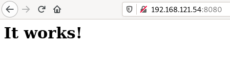
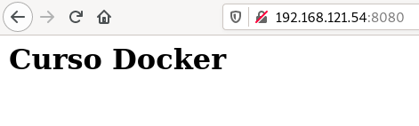

# Creando un contenedor con un servidor web

Tenemos muchas imágenes en el registro público **docker hub**, por ejemplo podemos crear un servidor web con apache 2.4:

```bash
$ docker run -d --name my-apache-app -p 8080:80 httpd:2.4
```

Vemos que el contenedor se está ejecutando, además con la opción `-p` mapeamos un puerto del equipo donde tenemos instalado el docker, con un puerto del contenedor: Si accedemos a la ip del ordenador que tiene instalado docker al primer puerto indicado, se redigira la petición a la ip del contenedor al segundo puerto indicado. **Nunca utilizamos directamente la ip del contenedor para acceder a él**. 

Para probarlo accede desde un navegador a **la ip del servidor con docker (en mi caso: 192.168.121.54 y al puerto 8080**:



Para acceder al log del contenedor podemos ejecutar:

```bash
$ docker logs my-apache-app
```

Con la opción `logs -f` seguimos visualizando los logs en tiempo real.

## Modificación del contenido servidor por el servidor web

Si consultamos la documentación de la imagen [`httpd`](https://hub.docker.com/_/httpd) en el registro docker Hub, podemos determinar que le servidor web que se ejecuta en el contenedor guardar sus ficheros (directorio *DocumentRoot*) en `/usr/local/apache2/htdocs/`. Vamos a crear un nu nuevo fichero `index.html` en ese directorio.

Lo podemos hacer de varias formas:

* Accediendo de forma interactiva al contenedor y haciendo la modificación:

```bash
$ docker exec -it my-apache-app bash

root@cf3cd01a4993:/usr/local/apache2# cd /usr/local/apache2/htdocs/
root@cf3cd01a4993:/usr/local/apache2/htdocs# echo "<h1>Curso Docker</h1>" > index.html
root@cf3cd01a4993:/usr/local/apache2/htdocs# exit
```

* Ejecutando directamente el comando de creación del fichero `index.html` en el contenedor:

```bash
$ docker exec my-apache-app bash -c 'echo "<h1>Curso Docker</h1>" > /usr/local/apache2/htdocs/index.html'
```

Independientemente de cómo hayamos creado el fichero, podemos volver a acceder al servidor web y comprobar que efectivamente hemos cambiado el contenido del `index.html`:




