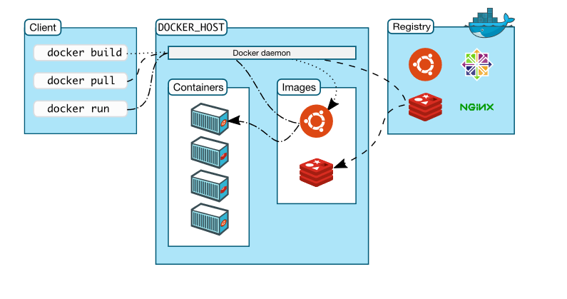

# Registros de imágenes: Docker Hub

El **Registro docker** es un componente donde se almacena las imágenes generadas por el Docker Engine. Puede estar instalada en un servidor independiente y es un componente fundamental, ya que nos permite distribuir nuestras aplicaciones. Es un proyecto open source que puede ser instalado gratuitamente en cualquier servidor, pero, como hemos comentado, el proyecto nos ofrece Docker Hub.

El nombre de una imagen suele estar formado por tres partes:

    usuario/nombre:etiqueta

* `usuario`: El nombre del usuario que la ha generado. Si la subimos a Docker Hub debe ser el mismo usuario que tenemos dado de alta en nuestra cuenta. Las **imáges oficiales** en Docker Hub no tienen nombre de usuario.
* `nombre`: Nombre significativo de la imagen.
* `etiqueta`: Nos permite versionar las imágenes. De esta manera controlamos los cambios que se van produciendo en ella. Si no indicamos etiqueta, por defecto se usa la etiqueta `latest`, por lo que la mayoría de las imágenes tienen una versión con este nombre.

