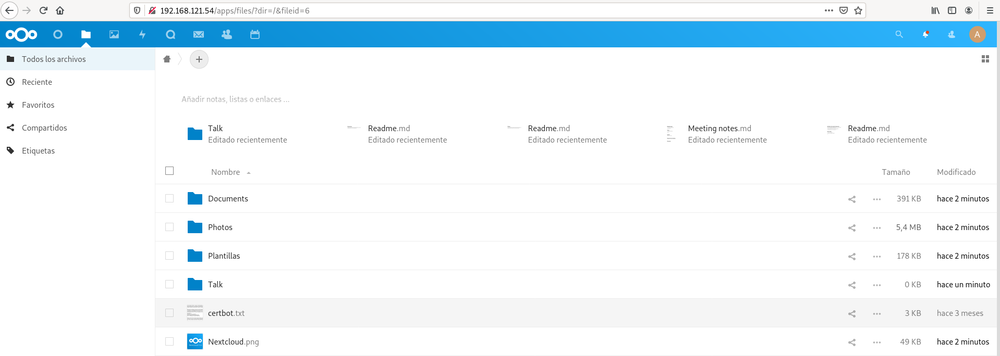

# Ejemplo 1: Contenedor nextcloud con almacenamiento persistente

Vamos a desplegar un contenedor con nextcloud, para simplificar la instalación vamos a realizar la instalación con una base de dato SQLite. Si estudiamos la documentación de la imagen [`nextcloud`](https://hub.docker.com/_/nextcloud) en Docker Hub, la forma más sencilla de no perder la información es crear un volumen para guardar el directorio `/var/www/html` del contenedor. Vamos a realizar el ejercicio usando volúmenes docker y bind mount.

## Ejemplo con volúmenes

Creamos un volumen:

```bash
$ docker volume create nextcloud
nextcloud
```

Y creamos el contenedor, guardando el directorio `/var/www/html` del contenedor en el volumen creado:

```bash
$ docker run -d -p 80:80  -v nextcloud:/var/www/html --name contenedor_nextcloud nextcloud
```

Comprobamos que podemos acceder, terminamos de configurar la aplicación y una vez operativa subimos un ficheros a la aplicación:



A continuación eliminamos el contenedor y creamos uno nuevo con el mismo volumen:

```bash
$ docker rm -f contenedor_nextcloud

$ docker run -d -p 80:80  -v nextcloud:/var/www/html --name contenedor_nextcloud nextcloud
```

Accede de nuevo a la aplicación comprueba que la aplicación sigue configurada y que los ficheros subidos no se han perdido.

## Ejemplo con bind mount

En este caso, vamos a crear un directorio en nuestro ordenador, que es el que vamos a montar en el contenedor:

```bash
mkdir datos_nextcloud
```

Y creamos el contenedor con la siguiente instrucción:

```bash
docker run -d -p 80:80 -v /home/vagrant/datos_nextcloud:/var/www/html --name contenedor_nextcloud nextcloud
```

Volvemos a acceder, configuramos la aplicación y subimos algún fichero.
Usando bind mount tenemos acceso al directorio:

```bash
$ cd datos_nextcloud/
~/datos_nextcloud$ ls
3rdparty  COPYING  config       core      custom_apps  index.html  lib  ocm-provider  ocs-provider  remote.php  robots.txt  themes
AUTHORS   apps     console.php  cron.php  data         index.php   occ  ocs           public.php    resources   status.php  version.php
```

Podemos comprobar que al eliminar el contenedor y crearlo de nuevo usando el mismo directorio bind mount, toda la configuración y los ficheros subidos no se han perdido.