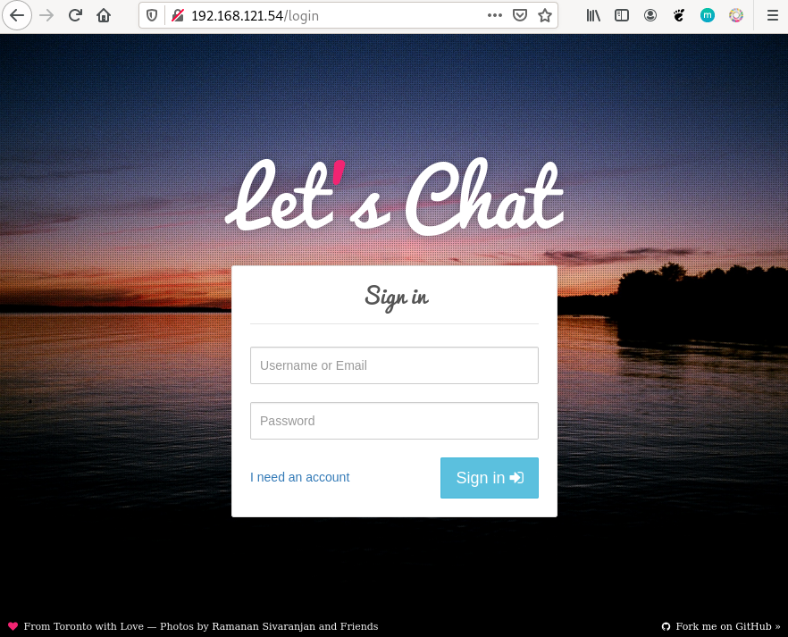

# Convertir el uso de la red bridge por defecto por una definida por el usuario

Hemos comentado que en muchos de las descripciones de las imágenes que encontramos en Docker Hub se sigue utilizando el parámetro `--link` para enlazar los contenedores que se conectan en la red bridge por defecto.

Por ejemplo, vamos a estudiar la imagen [`sdelements/lets-chat`](https://hub.docker.com/r/sdelements/lets-chat) que nos permite ejecutar una aplicación desarrollado con node.js y que implementa un chat. Esta aplicación usa una base de datos mongodb para guardar los datos.

Si nos fijamos en la [documentación](https://hub.docker.com/r/sdelements/lets-chat) de la imagen, nos pone la siguiente instrucción para crear el contenedor a partir de la imagen:

```bash
$ docker run  --name some-letschat --link some-mongo:mongo -p 8080:8080 -d sdelements/lets-chat
```

Estamos suponiendo que tenemos un contenedor llamado `some-mongo` creada a partir de la imagen [`mongo`](https://hub.docker.com/_/mongo) que esta sirviendo la base de datos:

```bash
$ docker run -d --name some-mongo mongo
```

El contenedor `some-letschat` se enlaza con el contenedor `some-mongo` con el parámetro `--link some-mongo:mongo`, es decir el contenedor de la aplicación podrá hacer referencia (por resolución estática) al servidor de base de datos por los dos nombres: el nombre del contenedor `some-mongo` y el alias que hemos creado `mongo`. Cómo comentábamos anteriormente el nombre de alias es el que se usa internamente por la aplicación para conectar con la base de datos.

## Usando una red bridge por defecto

Vamos a estudiar cómo podemos realizar este despliegue usando una red bridge definida por el usuario. En este caso, los contenedores que conectaremos a esa nueva red tendrán resolución DNs usando los nombres de los contenedores. Por lo tanto, como sabemos que la aplicación usa el nombre del alias (`mongo`) para conectarse al otro contenedor, lo único que tenemos que hacer es poner ese mismo nombre al contenedor de la base de datos.

Creamos una red bridge definida por el usuario:

```bash
$ docker network create red_letschat
```

Creamos el contenedor de la base de datos conectado a la nueva red, haciendo coincidir el nombre con el alias que poníamos anteriormente con el parámetro `--link`:

```bash
$ docker run -d --network red_letschat --name mongo mongo
```

Y el contenedor de la aplicación conectado a la nueva red:

```bash
$ docker run --name some-letschat --network red_letschat -p 8080:8080 -d sdelements/lets-chat
```


