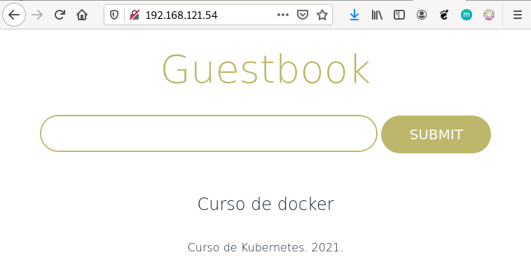

# Ejemplo 1: Despliegue de la aplicación Guestbook

En este ejemplo vamos a desplegar una aplicación web que requiere de dos servicios (servicio web y servicio de base de datos) para su ejecución. La aplicación se llama GuestBook y necesita los dos siguientes servicios:

* La aplicación guestbook es una aplicación web desarrollada en python que es servida por el puerto 5000/tcp. Utilizaremos la imagen `iesgn/guestbook`.
* Esta aplicación guarda la información en una base de datos no relacional redis, que utiliza el puerto 6379/tcp para conectarnos. Usaremos la imagen `redis`.

La aplicación guestbook por defecto utiliza el nombre `redis` para conectarse a la base de datos, por lo tanto debemos nombrar al contenedor redis con ese nombre para que tengamos una resolución de nombres adecuada.

Los dos contenedores tienen que estar en la misma red y deben tener acceso por nombres (resolución DNS) ya que de principio no sabemos que ip va a coger cada contenedor. Por lo tanto vamos a crear los contenedores en la misma red:

```bash
$ docker network create red_guestbook
```

Para ejecutar los contenedores:

```bash
$ docker run -d --name redis --network red_guestbook redis

$ docker run -d -p 80:5000 --name guestbook --network red_guestbook iesgn/guestbook
```

Algunas observaciones:

* No es necesario mapear el puerto de `redis`, ya que no vamos a acceder desde el exterior. Sin embargo la aplicación `guestbook` va a poder acceder a la base de datos porque están conectado a la misma red.
* Al nombrar al contenedor de la base de datos con `redis` se crea una entrada en el DNS que resuelve ese nombre con la ip del contenedor. Como hemos indicado, por defecto, la aplicación guestbook usa ese nombre para acceder.

