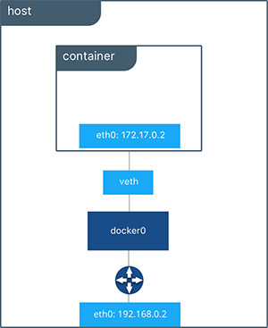

# Redes en docker
{: .no_toc }

## Contenido
{: .no_toc .text-delta }

1. TOC
{:toc}

* [Presentación](https://raw.githubusercontent.com/josedom24/presentaciones/main/iaw/redes_docker.pdf)

## Introducción a las redes en docker

Aunque hasta ahora no lo hemos tenido en cuenta, cada vez que creamos un contenedor, esté se conecta a una red virtual y docker hace una configuración del sistema (usando interfaces puente e iptables) para que la máquina tenga una ip interna, tenga acceso al exterior, podamos mapear (DNAT) puertos,...)

```bash
$ docker run -it --rm debian bash -c "ip a"
1: lo: <LOOPBACK,UP,LOWER_UP> mtu 65536 qdisc noqueue state UNKNOWN group default qlen 1000
    link/loopback 00:00:00:00:00:00 brd 00:00:00:00:00:00
    inet 127.0.0.1/8 scope host lo
       valid_lft forever preferred_lft forever
28: eth0@if29: <BROADCAST,MULTICAST,UP,LOWER_UP> mtu 1500 qdisc noqueue state UP group default 
    link/ether 02:42:ac:11:00:03 brd ff:ff:ff:ff:ff:ff link-netnsid 0
    inet 172.17.0.3/16 brd 172.17.255.255 scope global eth0
       valid_lft forever preferred_lft forever
```

**Nota: Hemos usado la opción `--rm` para al finalizar de ejecutar el proceso, el contenedor se elimina.**

Observamos que el contenedor tiene una ip en la red `172.17.0.0/16`. Además podemos comprobar que se ha creado un `bridge` en el host, al que se conectan los contenedores:

```bash
$ ip a
...
5: docker0: <BROADCAST,MULTICAST,UP,LOWER_UP> mtu 1500 qdisc noqueue state UP group default 
    link/ether 02:42:be:71:11:9e brd ff:ff:ff:ff:ff:ff
    inet 172.17.0.1/16 brd 172.17.255.255 scope global docker0
       valid_lft forever preferred_lft forever
    inet6 fe80::42:beff:fe71:119e/64 scope link 
       valid_lft forever preferred_lft forever
...
```

Además podemos comprobar que se han creado distintas cadenas en el cortafuegos para gestionar la comunicación de los contenedores. Podemos ejecutar: `iptables -L -n` y `iptables -L -n - t nat` y comprobarlo.

## Tipos de redes en docker

Cuando instalamos docker tenemos las siguientes redes predefinidas:

```bash
$ docker network ls
NETWORK ID          NAME                DRIVER              SCOPE
ec77cfd20583        bridge              bridge              local
69bb21378df5        host                host                local
089cc966eaeb        none                null                local
```

* Por defecto los contenedores que creamos se conectan a la red de tipo **bridge** llamada `bridge` (por defecto el direccionamiento de esta red es 172.17.0.0/16). Los contenedores conectados a esta red que quieren exponer algún puerto al exterior tienen que usar la opción `-p` para mapear puertos.

    Este tipo de red nos van a permitir: 

    * Aislar los distintos contenedores que tengo en distintas subredes docker, de tal manera que desde cada una de las subredes solo podremos acceder a los equipos de esa misma subred.
    * Aislar los contenedores del acceso exterior.
    * Publicar servicios que tengamos en los contenedores mediante redirecciones que docker implementará con las pertinentes reglas de iptables.

    

* Si conecto un contenedor a la red **host**, el contenedor estaría en la misma red que el host (por lo tanto toma direccionamiento del servidor DHCP de nuestra red). Además los puerto son accesibles directamente desde el host. Por ejemplo:

    ```bash
    $ docker run -d --name mi_servidor --network host josedom24/aplicacionweb:v1
        
    $ docker ps
    CONTAINER ID        IMAGE                        COMMAND                  CREATED             STATUS              PORTS               NAMES
    135c742af1ff        josedom24/aplicacionweb:v1   "/usr/sbin/apache2ct…"   3 seconds ago       Up 2 seconds                                  mi_servidor
    ```
    
    Prueba acceder directamente al puerto 80 del servidor para ver la página web.

* La red **none** no configurará ninguna IP para el contenedor y no tiene acceso a la red externa ni a otros contenedores. Tiene la dirección loopback y se puede usar para ejecutar trabajos por lotes.

## Gestionando las redes en docker

Tenemos que hacer una diferenciación entre dos tipos de redes **bridged**: 

* La red creada por defecto por docker para que funcionen todos los contenedores.
* Y las redes "bridged" definidas por el usuario.

Esta red "bridged" por defecto, que es la usada por defecto por los contenedores, se diferencia en varios aspectos de las redes "bridged" que creamos nosotros. Estos aspectos son los siguientes:

* Las redes que nosotros definamos proporcionan **resolución DNS** entre los contenedores, cosa que la red por defecto no hace a no ser que usemos opciones que ya se consideran "deprectated" (`--link`).
* Puedo **conectar en caliente** a los contenedores redes "bridged" definidas por el usuario. Si uso la red por defecto tengo que parar previamente el contenedor.
* Me permite gestionar de manera más segura el **aislamiento** de los contenedores, ya que si no indico una red al arrancar un contenedor éste se incluye en la red por defecto donde pueden convivir servicios que no tengan nada que ver.
* Tengo más **control** sobre la configuración de las redes si las defino yo. Los contenedores de la red por defecto comparten todos la misma configuración de red (MTU, reglas ip tables etc...).
* Los contenedores dentro de la  red "bridge" comparten todos ciertas variables de entorno lo que puede provocar ciertos conflictos.

En definitiva: **Es importante que nuestro contenedores en producción se estén ejecutando sobre una red definida por el usuario.**

Para gestionar las redes creadas por el usuario:

* **docker network ls**: Listado de las redes
* **docker network create**: Creación de redes. Ejemplos:
    * `docker network create red1`
    * `docker network create -d bridge --subnet 172.24.0.0./16 --gateway 172.24.0.1 red2`
* **docker network rm/prune**: Borrar redes. Teniendo en cuenta que no puedo borrar una red que tenga contenedores que la estén usando. deberé primero borrar los contenedores o desconectar la red.
* **docker network inspect**: Nos da información de la red.

Nota: **Cada red docker que creo crea un puente de red específico para cada red que podemos ver con `ip a`**:


## Asociación de redes a los contenedores

Imaginemos que he creados dos redes definidas por el usuario:

```bash
$ docker network create --subnet 172.28.0.0/16 --gateway 172.28.0.1 red1
$ docker network create red2
```

Vamos a trabajar en un primer momento con la `red1`. Vamos a crear dos contenedores conectados a dicha red:

```bash
$ docker run -d --name my-apache-app --network red1 -p 8080:80 httpd:2.4
```
Lo primero que vamos a comprobar es la resolución DNS:

```bash
$ docker run -it --name contenedor1 --network red1 debian bash
root@98ab5a0c2f0c:/# apt update && apt install dnsutils -y
...
root@98ab5a0c2f0c:/# dig my-apache-app
...
;; ANSWER SECTION:
my-apache-app.		600	IN	A	172.28.0.2
...
;; SERVER: 127.0.0.11#53(127.0.0.11)
...
```

Ahora podemos probar como podemos conectar un contenedor a una red. Para conectar usaremos `docker network connect` y para desconectarla usaremos `docker network disconnect`.

```bash
$ docker network connect red2 contenedor1 

$ docker start contenedor1
contenedor1
    
$ docker attach contenedor1
root@98ab5a0c2f0c:/# ip a
...
46: eth0@if47: <BROADCAST,MULTICAST,UP,LOWER_UP> mtu 1500 qdisc noqueue state UP group default
    ...
    inet 172.28.0.4/16 brd 172.28.255.255 scope global eth0
...
48: eth1@if49: <BROADCAST,MULTICAST,UP,LOWER_UP> mtu 1500 qdisc noqueue state UP group default 
...    
    inet 172.18.0.3/16 brd 172.18.255.255 scope global eth1
...
```

Tanto al crear un contenedor con el flag `--network`, como con la instrucción `docker network connect`, podemos usar algunos otros flags:

* `--dns`: para establecer unos servidores DNS predeterminados.
* `--ip6`: para establecer la dirección de red ipv6
* `--hostname` o `-h`: para establecer el nombre de host del contenedor. Si no lo establezco será el ID del mismo.

## Ejercicio: Instalación de Wordpress

Para la instalación de WordPress necesitamos dos contenedores: la base de datos (imagen `mariadb`) y el servidor web con la aplicación (imagen `wordpress`). Los dos contenedores tienen que estar en la misma red y deben tener acceso por nombres (resolución DNS) ya que de principio no sabemos que ip va a coger cada contenedor. Por lo tanto vamos a crear los contenedores en la misma red:

```bash
$ docker network create red_wp
```

Siguiendo la documentación de la imagen [mariadb](https://hub.docker.com/_/mariadb) y la imagen [wordpress](https://hub.docker.com/_/wordpress) podemos ejecutar los siguientes comandos para crear los dos contenedores:

```bash
$ docker run -d --name servidor_mysql \
                --network red_wp \
                -v /opt/mysql_wp:/var/lib/mysql \
                -e MYSQL_DATABASE=bd_wp \
                -e MYSQL_USER=user_wp \
                -e MYSQL_PASSWORD=asdasd \
                -e MYSQL_ROOT_PASSWORD=asdasd \
                mariadb
                
$ docker run -d --name servidor_wp \
                --network red_wp \
                -v /opt/wordpress:/var/www/html/wp-content \
                -e WORDPRESS_DB_HOST=servidor_mysql \
                -e WORDPRESS_DB_USER=user_wp \
                -e WORDPRESS_DB_PASSWORD=asdasd \
                -e WORDPRESS_DB_NAME=bd_wp \
                -p 80:80  
                wordpress

$ docker ps
CONTAINER ID        IMAGE               COMMAND                  CREATED             STATUS              PORTS                NAMES
5b2c5a82a524        wordpress           "docker-entrypoint.s…"   9 minutes ago       Up 9 minutes        0.0.0.0:80->80/tcp   servidor_wp
f70f22aed3d1        mariadb             "docker-entrypoint.s…"   9 minutes ago       Up 9 minutes        3306/tcp             servidor_mysql
```

Algunas observaciones:

* El contenedor `servidor_mysql` ejecuta un script `docker-entrypoint.sh` que es el encargado, a partir de las variables de entorno, configurar la base de datos: crea usuario, crea base de datos, cambia la contraseña del usuario root,... y termina ejecutando el servidor mariadb.
* Al crear la imagen `mariadb` han tenido en cuenta de que tiene que permitir la conexión desde otra máquina, por lo que en la configuración tenemos comentado el parámetro `bind-address`.
* Del mismo modo el contenedor `servidor_wp` ejecuta un script `docker-entrypoint.sh`, que entre otras cosas, a partir de las variables de entorno, ha creado el fichero `wp-config.php` de wordpress, por lo que durante la instalación no te ha pedido las credenciales de la base de datos.
* Si te das cuenta la variable de entorno `WORDPRESS_DB_HOST` la hemos inicializado al nombre del servidor de base de datos. Como están conectada a la misma red definida por el usuario, el contenedor wordpress al intentar acceder al nombre `servidor_mysql` estará accediendo al contenedor de la base de datos.
* Al servicio al que vamos a acceder desde el exterior es al servidor web, es por lo que hemos mapeado los puertos con la opción `-p`. Sin embargo en el contenedor de la base de datos no es necesario mapear los puertos porque no vamos a acceder a ella desde el exterior. Sin embargo, el contenedor `servidor_wp` puede acceder al puerto 3306 del `servidor_mysql` sin problemas ya que están conectados a la misma red.

## Ejercicios
{: .fs-9 }

1. Ejecuta una instrucción docker para visualizar el contenido del fichero `wp-config.php` y verifica que los parámetros de conexión a la base de datos son los mismo que los indicados en las variables de entorno.
2. Ejecuta una instrucción docker para comprobar que desde el `servidor_wp` podemos hacer ping usando el nombre `servidor_mysql`. (Tendrás que instalar el paquete `iputils-ping` en el contenedor).
3. Visualiza el fichero `/etc/mysql/mariadb.conf.d/50-server.cnf` del contenedor con la base de datos y comprueba cómo está configurado el parámetro `bind-address`.
4. Instala otro CMS PHP siguiendo la documentación de Docker Hub de la aplicación seleccionada.
