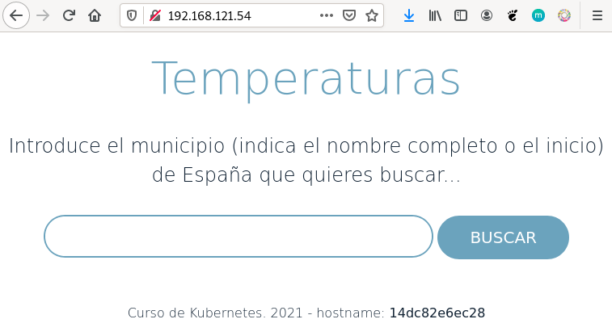

# Ejemplo 2: Despliegue de la aplicación Temperaturas

Vamos a hacer un despliegue completo de una aplicación llamada Temperaturas. Esta aplicación nos permite consultar la temperatura mínima y máxima de todos los municipios de España. Esta aplicación está formada por dos microservicios:

* `frontend`: Es una aplicación escrita en Python que nos ofrece una página web para hacer las búsquedas y visualizar los resultados. Este microservicio hará peticiones HTTP al segundo microservicio para obtener la información. Este microservicio ofrece el servicio en el puerto 3000/tcp. Usaremos la imagen `iesgn/temperaturas_frontend`.
* `backend`: Es el segundo microservicio que nos ofrece un servicio web de tipo API Restful. A esta API Web podemos hacerles consultas sobre los municipios y sobre las temperaturas. En este caso, se utiliza el puerto 5000/tcp para ofrecer el servicio. Usaremos la imagen `iesgn/temperaturas_backend`.

El microservicio `frontend` se conecta a `backend` usando el nombre `temperaturas-backend`. Por lo tanto el contenedor con el micorservicio `backend` tendrá ese nombre para disponer de una resolución de nombres adecuada en el dns.

Vamos a crear una red para conectar los dos contenedores:

```bash
$ docker network create red_temperaturas
```

Para ejecutar los contenedores:

```bash
$ docker run -d --name temperaturas-backend --network red_temperaturas iesgn/temperaturas_backend

$ docker run -d -p 80:3000 --name temperaturas-frontend --network red_temperaturas iesgn/temperaturas_frontend
```

Algunas observaciones:

* Este es un tipo de aplicación, que se caracteriza por no necesitar guardar información para su funcionamiento. Son las denominadas **aplicaciones sin estado**, por lo tanto no necesitamos almacenamiento adicional para la aplicación.
* No es necesario mapear el puerto de `backend`, ya que no vamos a acceder desde el exterior. Sin embargo el microservicio `frontend` va a poder acceder a `backend` al puerto 5000 porque están conectado a la misma red.
* Al nombrar al contenedor de la base de datos con `temperaturas-backend` se crea una entrada en el DNS que resuelve ese nombre con la ip del contenedor. Como hemos indicado, por defecto, el microservicio `frontend` usa ese nombre para acceder.

