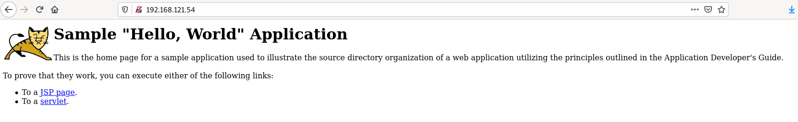

# Ejemplo 4: Despliegue de tomcat + nginx

En este ejemplo vamos a desplegar una aplicación muy sencilla en un servidor de aplicación Tomcat, a la que accederemos utilizando un proxy inverso nginx. En este ejercicio, además de seguir trabajando con las redes de tipo bridge definida por el usuario, vamos a usar bind mount para montar los ficheros de configuración y de despliegue en los contenedores.

## Desplegando tomcat

Antes de hacer el despliegue del primer contenedor, vamos a crear una red bridge para conectar los contenedores:

```bash
$ docker network create red_tomcat
```

A continuación vamos a crear un contenedor a partir de la imagen [`tomcat`](https://hub.docker.com/_/tomcat). En la documentación podemos ver que el directorio `/usr/local/tomcat/webapps/` es donde tenemos que poner el fichero de despliegue `war` (vamos a usar **bind mount** para montar el fichero war en el directorio). No vamos a mapear puerto porque no vamos a acceder a este contenedor desde el exterior.

Tenemos un directorio donde tenemos el fichero war (puedes encontrar estos ficheros en el [repositorio github](https://github.com/iesgn/curso_docker_2021/tree/main/ejemplos/sesion4/ejemplo4)):

```bash
$ cd tomcat
~/tomcat$ ls
default.conf  sample.war
```

Y creamos el contenedor conectada a nuestra nueva red:

```bash
$ docker run -d --name aplicacionjava \
                --network red_tomcat \
                -v /home/vagrant/tomcat/sample.war:/usr/local/tomcat/webapps/sample.war:ro \
                tomcat:9.0
```

## Desplegando nginx como proxy inverso

Como vimos anteriormente en el directorio de trabajo tenemos también la configuración de nginx para que funcione como proxy inverso:

```bash
server {
    listen       80;
    listen  [::]:80;
    server_name  localhost;

    location / {
        root   /usr/share/nginx/html;
	proxy_pass http://aplicacionjava:8080/sample/;
    }
    error_page   500 502 503 504  /50x.html;
    location = /50x.html {
        root   /usr/share/nginx/html;
    }
}
```
Como vemos para realizar el proxy inverso usamos la directiva `proxy_pass`indicando la dirección que nos ofrece tomcat, en este caso usamos el nombre del contenedor anterior (`aplicacionjava`) que será resuelto por el servidor DNS interno, usando el puerto estándar de tomcat el 8080 y el directorio `sample` donde se ha desplegado la aplicación. Para la creación del contenedor de nginx:

```bash
$ docker run -d --name proxy \
                -p 80:80 \
                --network red_tomcat \
                -v /home/vagrant/tomcat/default.conf:/etc/nginx/conf.d/default.conf:ro \
                nginx
```

Y al acceder la ip de nuestro host:


