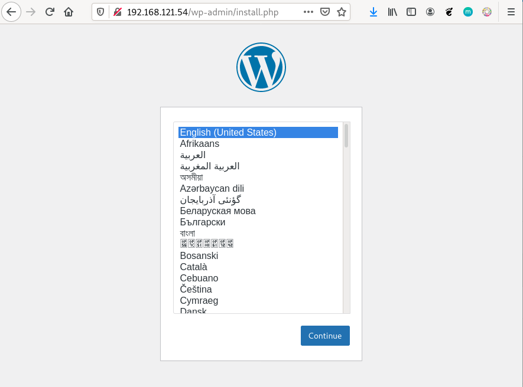

# Ejemplo 3: Despliegue de Wordpress + mariadb

Para la instalación de WordPress necesitamos dos contenedores: la base de datos (imagen `mariadb`) y el servidor web con la aplicación (imagen `wordpress`). Los dos contenedores tienen que estar en la misma red y deben tener acceso por nombres (resolución DNS) ya que de principio no sabemos que ip va a coger cada contenedor. Por lo tanto vamos a crear los contenedores en la misma red:

```bash
$ docker network create red_wp
```

Siguiendo la documentación de la imagen [mariadb](https://hub.docker.com/_/mariadb) y la imagen [wordpress](https://hub.docker.com/_/wordpress) podemos ejecutar los siguientes comandos para crear los dos contenedores:

```bash
$ docker run -d --name servidor_mysql \
                --network red_wp \
                -v /opt/mysql_wp:/var/lib/mysql \
                -e MYSQL_DATABASE=bd_wp \
                -e MYSQL_USER=user_wp \
                -e MYSQL_PASSWORD=asdasd \
                -e MYSQL_ROOT_PASSWORD=asdasd \
                mariadb
                
$ docker run -d --name servidor_wp \
                --network red_wp \
                -v /opt/wordpress:/var/www/html/wp-content \
                -e WORDPRESS_DB_HOST=servidor_mysql \
                -e WORDPRESS_DB_USER=user_wp \
                -e WORDPRESS_DB_PASSWORD=asdasd \
                -e WORDPRESS_DB_NAME=bd_wp \
                -p 80:80 \
                wordpress

$ docker ps
CONTAINER ID        IMAGE               COMMAND                  CREATED             STATUS              PORTS                NAMES
5b2c5a82a524        wordpress           "docker-entrypoint.s…"   9 minutes ago       Up 9 minutes        0.0.0.0:80->80/tcp   servidor_wp
f70f22aed3d1        mariadb             "docker-entrypoint.s…"   9 minutes ago       Up 9 minutes        3306/tcp             servidor_mysql
```

Algunas observaciones:

* El contenedor `servidor_mysql` ejecuta un script `docker-entrypoint.sh` que es el encargado, a partir de las variables de entorno, configurar la base de datos: crea usuario, crea base de datos, cambia la contraseña del usuario root,... y termina ejecutando el servidor mariadb.
* Al crear la imagen `mariadb` han tenido en cuenta de que tiene que permitir la conexión desde otra máquina, por lo que en la configuración tenemos comentado el parámetro `bind-address`.
* Del mismo modo el contenedor `servidor_wp` ejecuta un script `docker-entrypoint.sh`, que entre otras cosas, a partir de las variables de entorno, ha creado el fichero `wp-config.php` de wordpress, por lo que durante la instalación no te ha pedido las credenciales de la base de datos.
* Si te das cuenta la variable de entorno `WORDPRESS_DB_HOST` la hemos inicializado al nombre del servidor de base de datos. Como están conectada a la misma red definida por el usuario, el contenedor wordpress al intentar acceder al nombre `servidor_mysql` estará accediendo al contenedor de la base de datos.
* Al servicio al que vamos a acceder desde el exterior es al servidor web, es por lo que hemos mapeado los puertos con la opción `-p`. Sin embargo en el contenedor de la base de datos no es necesario mapear los puertos porque no vamos a acceder a ella desde el exterior. Sin embargo, el contenedor `servidor_wp` puede acceder al puerto 3306 del `servidor_mysql` sin problemas ya que están conectados a la misma red.

