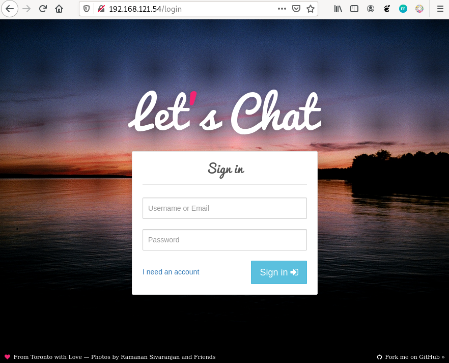

# El comando docker-compose

Una vez hemos creado el archivo `docker-compose.yml` tenemos que empezar a trabajar con él, es decir a crear los contenedores que describe su contenido. 

Esto lo haremos mediante el ejecutable [`docker-compose`](https://docs.docker.com/compose/reference/). **Es importante destacar que debemos invocarla desde el directorio en el que se encuentra el fichero `docker-compose.yml`**.

Los subcomandos más usados son:

* `docker-compose up`: Crear los contenedores (servicios) que están descritos en el `docker-compose.yml`.
* `docker-compose up -d`: Crear en modo detach los contenedores (servicios) que están descritos en el `docker-compose.yml`. Eso significa que no muestran mensajes de log en el terminal y que se  nos vuelve a mostrar un prompt.
* `docker-compose stop`: Detiene los contenedores que previamente se han lanzado con `docker-compose up`.
* `docker-compose run`: Inicia los contenedores descritos en el `docker-compose.yml` que estén parados.
* `docker-compose rm`: Borra los contenedores parados del escenario. Con las opción `-f` elimina también los contenedores en ejecución.
* `docker-compose pause`: Pausa los contenedores que previamente se han lanzado con `docker-compose up`.
* `docker-compose unpause`: Reanuda los contenedores que previamente se han pausado.
* `docker-compose restart`: Reinicia los contenedores. Orden ideal para reiniciar servicios con nuevas configuraciones.
* `docker-compose down`:  Para los contenedores, los borra  y también borra las redes que se han creado con `docker-compose up` (en caso de haberse creado).
* `docker-compose down -v`: Para los contenedores y borra contenedores, redes y volúmenes.
* `docker-compose logs`: Muestra los logs de todos los servicios del escenario. Con el parámetro `-f`podremos ir viendo los logs en "vivo".
* `docker-compose logs servicio1`: Muestra los logs del servicio llamado `servicio1` que estaba descrito en el `docker-compose.yml`.
* `docker-compose exec servicio1 /bin/bash`: Ejecuta una orden, en este caso `/bin/bash` en un contenedor llamado `servicio1` que estaba descrito en el `docker-compose.yml`
* `docker-compose build`: Ejecuta, si está indicado, el proceso de construcción de una imagen que va a ser usado en el `docker-compose.yml`  a partir de los  ficheros `Dockerfile` que se indican.
* `docker-compose top`: Muestra  los procesos que están ejecutándose en cada uno de los contenedores de los servicios.

## Despliegue de Let's Chat

Para desplegar la aplicación Let's Chat que vimos en el punto anterior, ejecutamos la siguiente instrucción en el directorio donde tengamos el fichero `docker-compose.yml`:

```bash
$ docker-compose up -d
Creating network "letschat_default" with the default driver
Creating mongo ... done
Creating letschat ... done
```

Podemos ver los contenedores que se están ejecutando:

```bash
$ docker-compose ps
  Name               Command             State               Ports             
-------------------------------------------------------------------------------
letschat   npm start                     Up      5222/tcp, 0.0.0.0:80->8080/tcp
mongo      docker-entrypoint.sh mongod   Up      27017/tcp                   
```

Podemos acceder desde el navegador a la aplicación:



Finalmente podemos destruir el escenario:

```bash
$ docker-compose down 
Stopping letschat ... done
Stopping mongo   ... done
Removing letschat ... done
Removing mongo   ... done
Removing network letschat_default
```

