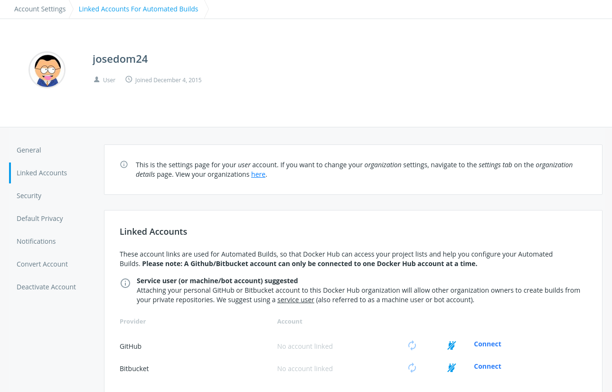
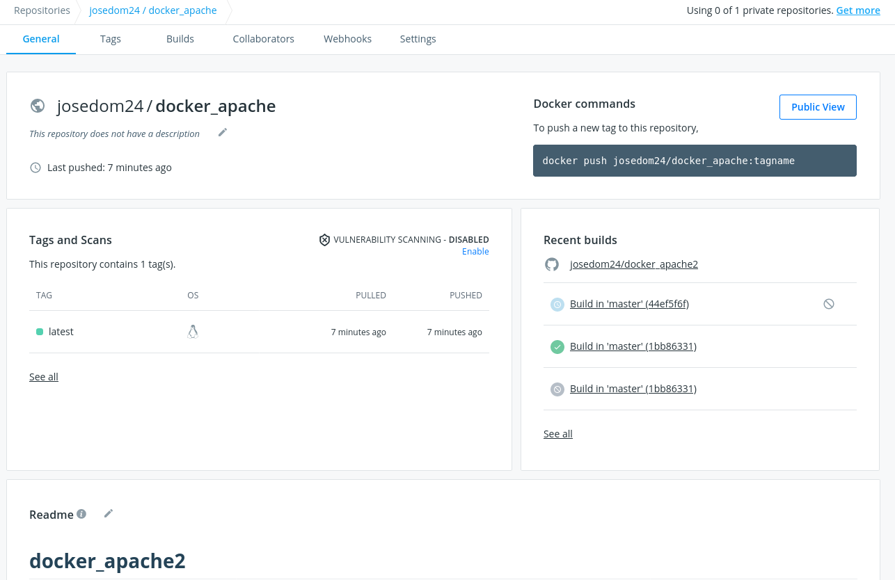
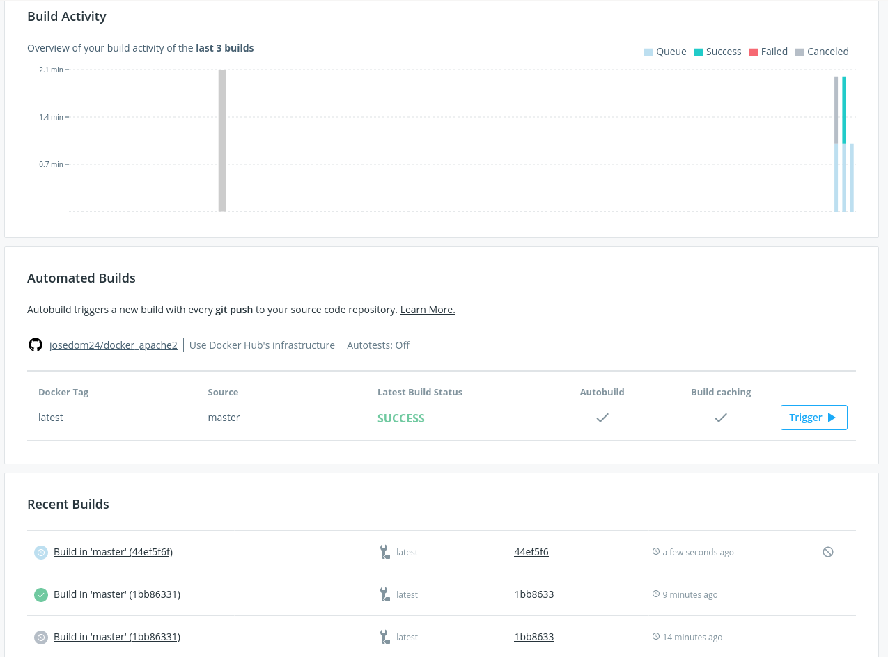

# Creación automática de imágenes en Docker Hub
{: .no_toc }

* [Presentación](https://raw.githubusercontent.com/josedom24/presentaciones/main/iaw/imagenes_dockerhub.pdf)

La página Docker Hub nos ofrece un sistema de integración continúa para la creación automática de imágenes. Lo que vamos a hacer es conectar nuestro repositorio de DockerHub con un repositorio de GitHub, donde tengamos el contexto para la construcción de la imagén (`Dokerfile` y ficheros necesarios). Los pasos serán:

1. Conectamos nuestra cuenta de Docker Hub con nuestra cuenta de GitHub. Para ello en la sección `Account Settings` - `Linked Accounts`:

    

    Pulsamos sobre `Connect` de GitHub, y autorizamos a DockerHub que acceda a nuestros repositorios:

    

2. Crear un nuevo repositorio en Docker Hub: Ponemos un nombre y conectamos a un repositorio GitHub con el contexto. Nota: Se añadirá una clave pública en el repositorio  de github para que Docker Hub pueda acceder al repositorio.

    

3. En la sección `Build` del repositorio vemos las distintas *build* que vamos generando.

    

4. Cada vez que hagamos un push en el repositorio GitHub se creará un nuevo *build* y se creará una nueva imagen.

    