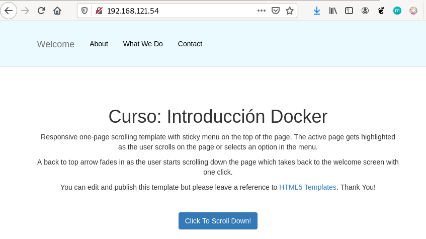

# Ejemplo 1: Construcción de imágenes con una página estática

En este ejemplo vamos a crear una imágen con una página estática. Vamos a crear tres versiones de la imagen, y puedes encontrar los ficheros en este [directorio](https://github.com/iesgn/curso_docker_2021/tree/main/ejemplos/sesion6/ejemplo1) del repositorio.

## Versión 1: Desde una imagen base

Tenemos un directorio, que en Docker se denomina contexto, donde tenemos el fichero `Dockerfile` y un directorio, llamado `public_html` con nuestra página web:

```bash
$ ls
Dockerfile  public_html
```

En este caso vamos a usar una imagen base de un sistema operativo sin ningún servicio. El fichero `Dockerfile` será el siguiente:

```Dockerfile
FROM debian
RUN apt-get update && apt-get install -y apache2 && apt-get clean && rm -rf /var/lib/apt/lists/*
ADD public_html /var/www/html/
EXPOSE 80
CMD ["/usr/sbin/apache2ctl", "-D", "FOREGROUND"]
```

Al usar una imagen base `debian` tenemos que instalar los paquetes necesarios para tener el servidor web, en este acaso apache2. A continuación añadiremos el contenido del directorio `public_html` al directorio `/var/www/html/` del contenedor y finalmente indicamos el comando que se deberá ejecutar al crear un contenedor a partir de esta imagen: iniciamos el servidor web en segundo plano.

Para crear la imagen ejecutamos:

```bash
$ docker build -t josedom24/ejemplo1:v1 .
```

Comprobamos que la imagen se ha creado:

```bash
$ docker images
REPOSITORY             TAG                 IMAGE ID            CREATED             SIZE
josedom24/ejemplo1     v1                  8c3275799063        1 minute ago      226MB
```

Y podemos crear un contenedor:

```bash
$ docker run -d -p 80:80 --name ejemplo1 josedom24/ejemplo1:v1
```

Y acceder con el navegador a nuestra página:




## Versión 2: Desde una imagen con apache2

En este caso el fichero `Dockerfile` sería el siguiente:

```Dockerfile
FROM httpd:2.4
ADD public_html /usr/local/apache2/htdocs/
EXPOSE 80
```

En este caso no necesitamos instalar nada, ya que la imagen tiene instalado el servidor web. En este caso y siguiendo la documentación de la imagen el **DocumentRoot* es `/usr/local/apache2/htdocs/`. No es necesario indicar el `CMD` ya que por defecto el contenedor creado a partir de esta imagen ejecutará el mismo proceso que la imagen base, es decir, la ejecución del servidor web.

De forma similar, crearíamos una imagen y un contenedor:

```bash
$ docker build -t josedom24/ejemplo1:v2 .
$ docker run -d -p 80:80 --name ejemplo1 josedom24/ejemplo1:v2
```

## Versión 3: Desde una imagen con nginx

En este caso el fichero `Dockerfile` sería:

```Dockerfile
FROM nginx
ADD public_html /usr/share/nginx/html
EXPOSE 80
```

De forma similar, crearíamos una imagen y un contenedor:

```bash
$ docker build -t josedom24/ejemplo1:v3 .
$ docker run -d -p 80:80 --name ejemplo1 josedom24/ejemplo1:v3
```
