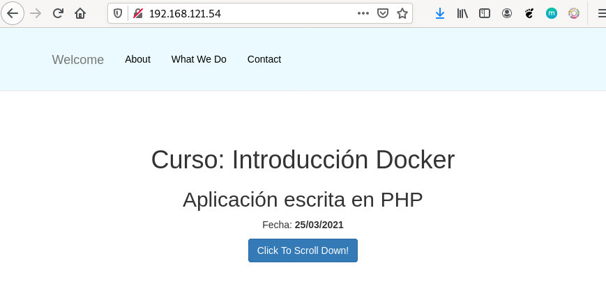
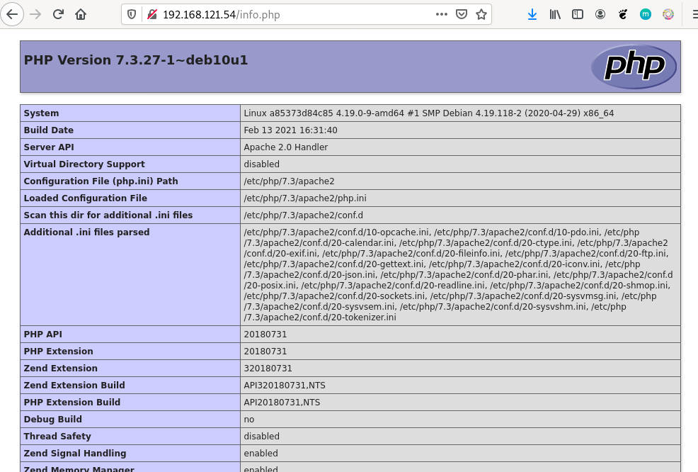
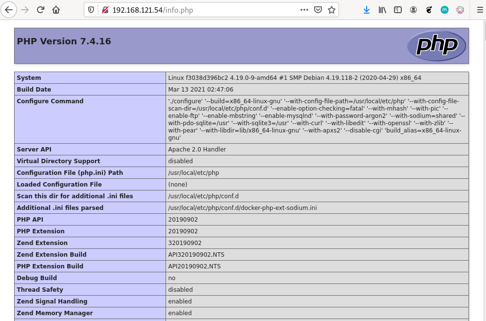

# Ejemplo 2: Construcción de imágenes con una una aplicación PHP

En este ejemplo vamos a crear una imágen con una página desarrollada con PHP. Vamos a crear dos versiones de la imagen, y puedes encontrar los ficheros en este [directorio](https://github.com/iesgn/curso_docker_2021/tree/main/ejemplos/sesion6/ejemplo2) del repositorio.

## Versión 1: Desde una imagen base

En el contexto vamos a tener el fichero `Dockerfile` y un directorio, llamado `app` con nuestra aplicación.

En este caso vamos a usar una imagen base de un sistema operativo sin ningún servicio. El fichero `Dockerfile` será el siguiente:

```Dockerfile
FROM debian
RUN apt-get update && apt-get install -y apache2 libapache2-mod-php7.3 php7.3 && apt-get clean && rm -rf /var/lib/apt/lists/*
ADD app /var/www/html/
RUN rm /var/www/html/index.html
EXPOSE 80
CMD ["/usr/sbin/apache2ctl", "-D", "FOREGROUND"]
```

Al usar una imagen base `debian` tenemos que instalar los paquetes necesarios para tener el servidor web, php y las librerias necesarias. Eliminamos el A continuación añadiremos el contenido del directorio `app` al directorio `/var/www/html/` del contenedor. Hemos borrado el fichero `/var/www/html/index.html` para que no sea el que se muestre por defecto y finalmente indicamos el comando que se deberá ejecutar al crear un contenedor a partir de esta imagen: iniciamos el servidor web en segundo plano.

Para crear la imagen ejecutamos:

```bash
$ docker build -t josedom24/ejemplo2:v1 .
```

Comprobamos que la imagen se ha creado:

```bash
$ docker images
REPOSITORY             TAG                 IMAGE ID            CREATED             SIZE
josedom24/ejemplo2     v1                  8c3275799063        1 minute ago      226MB
```

Y podemos crear un contenedor:

```bash
$ docker run -d -p 80:80 --name ejemplo2 josedom24/ejemplo2:v1
```

Y acceder con el navegador a nuestra página:



La aplicación tiene un fichero `info.php`que me da información sobre PHP, en este caso observamos que estamos usando la versión 7.3:




## Versión 2: Desde una imagen con PHP instalado

En este caso el fichero `Dockerfile` sería el siguiente:

```Dockerfile
FROM php:7.4-apache
ADD app /var/www/html/
EXPOSE 80
```

En este caso no necesitamos instalar nada, ya que la imagen tiene instalado el servidor web y PHP. No es necesario indicar el `CMD` ya que por defecto el contenedor creado a partir de esta imagen ejecutará el mismo proceso que la imagen base, es decir, la ejecución del servidor web.

De forma similar, crearíamos una imagen y un contenedor:

```bash
$ docker build -t josedom24/ejemplo2:v2 .
$ docker run -d -p 80:80 --name ejemplo2 josedom24/ejemplo2:v2
```

Podemos acceder al fichero `info.php` para comprobar la versión de php que estamos utilizando con esta imagen:


