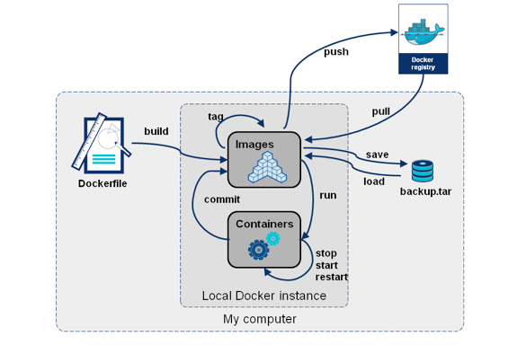

# Creación de imágenes en docker

Hasta ahora hemos creado contenedores a partir de las imágenes que encontramos en Docker Hub. Estas imágenes las han creado otras personas.

Para crear un contenedor que sirva nuestra aplicación, tendremos que crear una imagen personaliza, es lo que llamamos "dockerizar" una aplicación.

